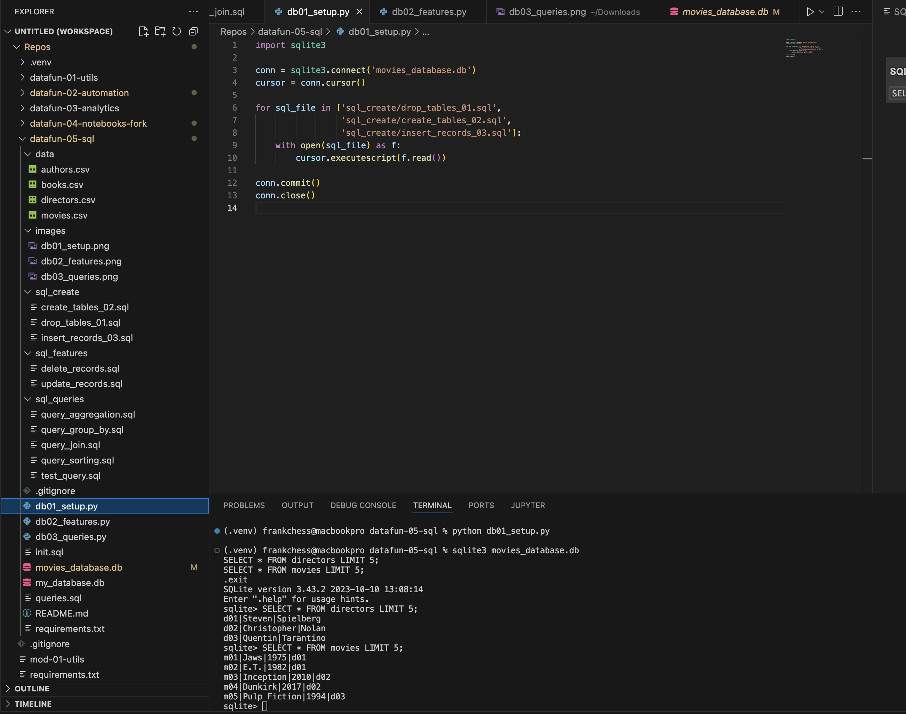
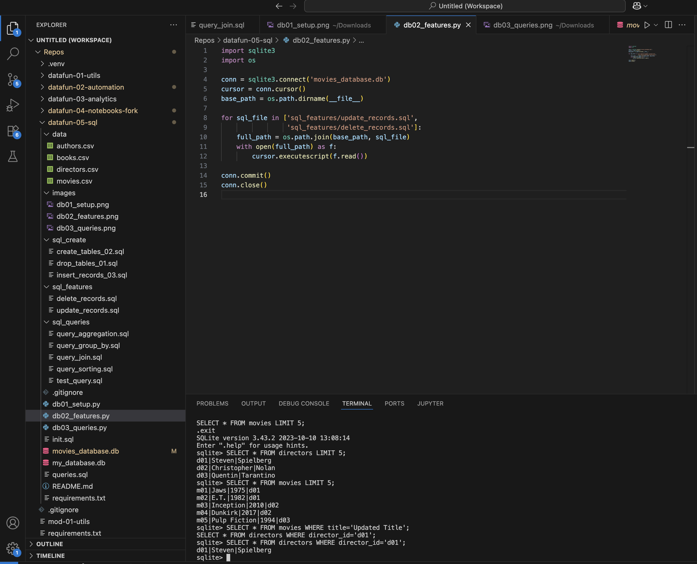
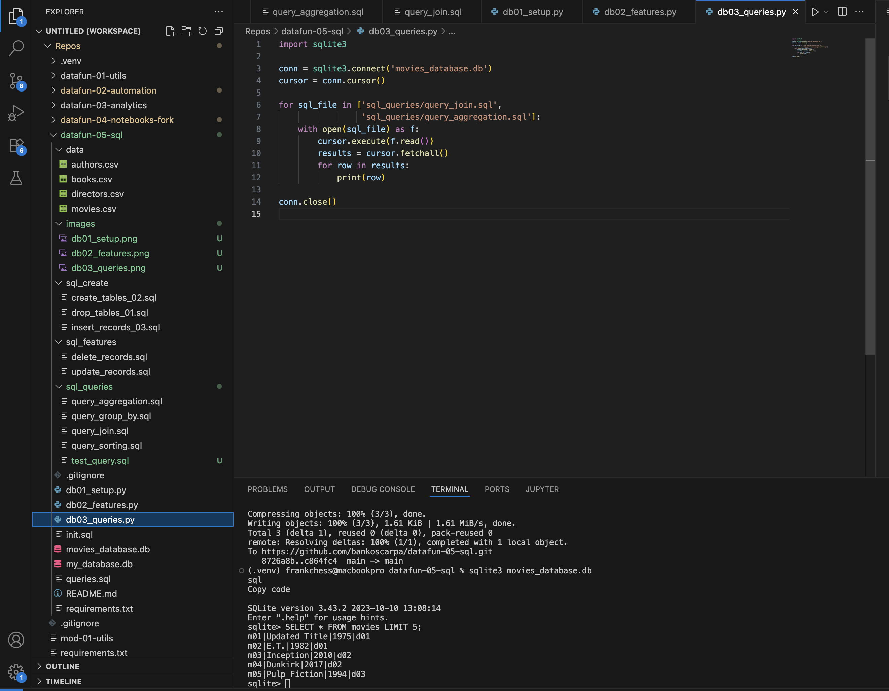

# datafun-05-sql
Week 5 Coursework

Learning SQL! 
Why did the SQL student bring a ladder to class?
Because they heard they needed to learn how to scale tables. 🪜📊

Project Overview

This project demonstrates database schema design, initialization, feature engineering, and SQL queries using SQLite and Python. The project uses a movies and directors dataset to illustrate relationships, aggregations, and data manipulation.

Database Schema
Tables
directors
Column	Type	Key	Description
director_id	TEXT	PK	Unique identifier for each director
first	TEXT		Director's first name
last	TEXT		Director's last name
movies
Column	Type	Key	Description
movie_id	TEXT	PK	Unique identifier for each movie
title	TEXT		Movie title
year_released	INTEGER		Year the movie was released
director_id	TEXT	FK	References directors(director_id)

Relationship: One director can have multiple movies (1-to-many).

Project Structure
project_root/
│
├─ sql_create/
│  ├─ drop_tables_01.sql      # Drops existing tables
│  ├─ create_tables_02.sql    # Creates directors and movies tables
│  └─ insert_records_03.sql   # Inserts initial records
│
├─ sql_features/
│  ├─ update_records.sql      # Updates one or more records
│  └─ delete_records.sql      # Deletes one or more records
│
├─ sql_queries/
│  ├─ query_aggregation.sql   # Aggregation queries (COUNT, AVG, SUM)
│  ├─ query_filter.sql        # Filter queries (WHERE)
│  ├─ query_sorting.sql       # Sorting queries (ORDER BY)
│  ├─ query_group_by.sql      # Group by queries (GROUP BY)
│  └─ query_join.sql          # Join queries (INNER/LEFT JOIN)
│
├─ data/
│  ├─ directors.csv           # Optional CSV data for directors
│  └─ movies.csv              # Optional CSV data for movies
│
├─ db01_setup.py              # Initializes database and inserts records
├─ db02_features.py           # Runs updates/deletes
├─ db03_queries.py            # Runs all SQL queries
└─ movies_database.db         # SQLite database (generated)

Python Scripts
db01_setup.py

Connects to movies_database.db.

Drops existing tables, creates schema, and inserts initial records.

Can be re-run to reset the database.

db02_features.py

Executes sql_features/update_records.sql and delete_records.sql.

Demonstrates updates, deletes, and feature engineering.

db03_queries.py

Executes all SQL queries in sql_queries/.

Prints results for aggregation, filtering, sorting, grouping, and joins.

Usage

Initialize database:

python db01_setup.py

Apply feature updates:

python db02_features.py

Run queries:

python db03_queries.py

Inspect database:

Use SQLite shell: sqlite3 movies_database.db

Or use VS Code SQLite Viewer to explore tables.

Sample Query Outputs

Query Join (Director + Movies):

('Steven Spielberg', 'Updated Title')
('Steven Spielberg', 'E.T.')
('Christopher Nolan', 'Inception')
('Christopher Nolan', 'Dunkirk')
('Quentin Tarantino', 'Pulp Fiction')

Query Group By (Movies per Director):

('d01', 2)
('d02', 2)
('d03', 1)
('d04', 1)

Notes

Database tables are related via director_id.

CSV files are optional; the project works using SQL inserts.

Python scripts use absolute paths to find SQL files relative to the script folder.